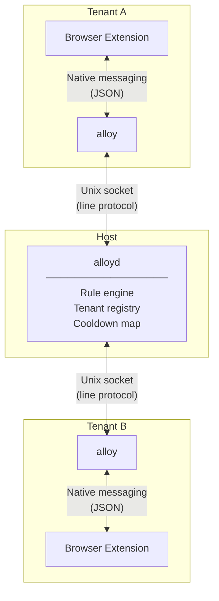
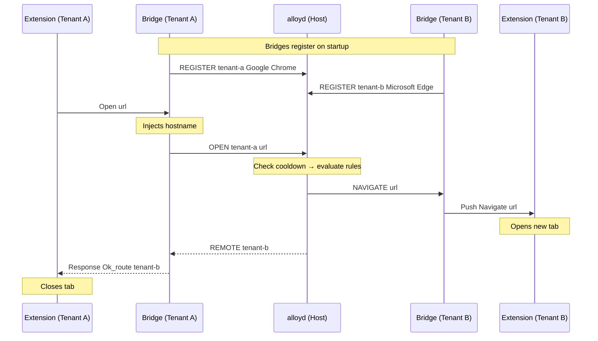

# Alloy

URL routing for Linux desktops. A daemon on the host routes URLs between
isolated browser instances in different tenants (host or systemd-nspawn
containers), identified by hostname.

## How It Works





After routing, the daemon suppresses the same (tenant, URL) pair for a
configurable cooldown window to prevent redirect loops.

## Installation

Two `.deb` packages are provided via the
[releases workflow](../../actions/workflows/deb.yml).

### Host

```bash
sudo dpkg -i alloyd_<version>_amd64.deb
systemctl --user enable --now alloyd
```

### Each Tenant / Container

```bash
sudo dpkg -i alloy_<version>_amd64.deb
```

Installs the bridge/CLI, native messaging manifests (Chromium and Edge),
a signed `.crx` that
[auto-installs](https://developer.chrome.com/docs/extensions/how-to/distribute/install-extensions-linux)
on next browser launch, and a `.desktop` entry for use as the default URL
handler.

The daemon's socket must be accessible from each tenant. For containers,
bind-mount the user's runtime directory entry:

```ini
# /etc/systemd/nspawn/<container>.nspawn
[Files]
Bind=/run/user/1000/alloy.sock
```

## Configuration

The daemon reads `~/.config/alloy/config.json` (or a path given as its
first argument). See [`config.example.json`](config.example.json).

```json
{
  "socket": "/run/user/1000/alloy.sock",
  "tenants": {
    "host-machine": { "browser_cmd": "chromium", "label": "Host", "color": "#4285F4" },
    "work-container": { "browser_cmd": "machinectl shell work -- chromium", "label": "Work", "color": "#EA4335" }
  },
  "rules": [
    { "pattern": "https://github[.]com/.*", "target": "work-container", "enabled": true }
  ],
  "defaults": {
    "unmatched": "local",
    "cooldown_seconds": 5,
    "browser_launch_timeout": 10
  }
}
```

| Field | Description |
|-------|-------------|
| `tenants` | Hostname → `{ browser_cmd, label, color, brand? }`. Keys must match actual hostnames. `brand` is optional and auto-populated on registration. |
| `rules` | Regex patterns, evaluated top-to-bottom. First match wins. |
| `defaults.unmatched` | `"local"` or a tenant hostname for unmatched URLs. |
| `defaults.cooldown_seconds` | Suppress repeated (tenant, URL) routing within this window. |
| `defaults.browser_launch_timeout` | Seconds to wait for browser registration after `browser_cmd`. |

Configuration can also be modified via the extension context menu or the
CLI (`get-config`, `set-config`, `add-rule`, `update-rule`,
`delete-rule`).

## Usage

### CLI

```bash
alloy open <url>                   # Route via rules
alloy open-on <tenant> <url>       # Route to specific tenant
alloy test <url>                   # Dry-run rule evaluation
alloy status                       # Registered tenants, uptime
alloy get-config                   # Print config as JSON
alloy set-config <json-file>       # Replace config
alloy add-rule '<json>'            # Append rule
alloy update-rule <index> '<json>' # Update rule
alloy delete-rule <index>          # Delete rule
```

Socket path defaults to `/run/user/<uid>/alloy.sock` (override with
`ALLOY_SOCKET`).

To set as the default URL handler:

```bash
xdg-settings set default-web-browser alloy.desktop
```

### Browser Extension

The extension runs as a Chromium service worker that communicates with
the daemon through the native messaging bridge.

#### Navigation Interception

Every top-frame HTTP/HTTPS navigation is sent to the daemon as an `OPEN`
command (the bridge injects the tenant ID transparently). Based on the
response:

| Response | Behaviour |
|----------|-----------|
| **LOCAL** | Navigation proceeds normally in the current browser. |
| **REMOTE** | The URL has been pushed to the target tenant's browser; logged to the service worker console. |
| **ERR** | Error is logged; navigation proceeds. |

Internal URLs (`chrome://`, `about:`, `chrome-extension://`) are ignored.

#### Receiving URLs

When the daemon pushes a `NAVIGATE` message (another tenant routed a URL
here), the extension opens a new tab with that URL.

#### Popup

Click the extension icon to open a small panel:

- **Connection indicator** — green dot (connected) or red dot
  (disconnected) showing the native messaging host status.
- **View status** — queries the daemon for registered tenants and
  uptime; displays the JSON response.
- **View config** — queries the daemon for the current configuration;
  displays the JSON response.
- **Reconnect** — re-establishes the native messaging connection if it
  was lost.

#### Context Menus

Right-click context menus provide quick routing actions:

| Context | Menu item | Action |
|---------|-----------|--------|
| **Link** | *Open in tenant…* | Routes the link URL through the daemon. |
| **Page** | *Send page to tenant…* | Routes the current page URL through the daemon. |
| **Page** | *Add routing rule…* | Opens a dialog to create a new rule (regex + tenant). The pattern is pre-filled from the current page's origin. |
| **Page** | *Delete matching rule* | Tests the current URL against rules and deletes the matching rule. |

## Building from Source

```bash
opam install . --deps-only --with-test
cd extension && npm install && cd ..
```

| Target | Description |
|--------|-------------|
| `make build` | `dune build @all` |
| `make test` | `dune runtest` |
| `make test-extension` | Jest tests for the extension |
| `make lint` | `dune build @check` |
| `make fmt` | `dune fmt` |
| `make deb VERSION=x.y.z` | Build `.deb` packages (requires `fakeroot`, `debhelper`) |
| `make clean` | Remove build artifacts |

`debian/rules` calls `dune build --profile release` for optimized output.

## License

See [LICENSE](LICENSE) for details.
