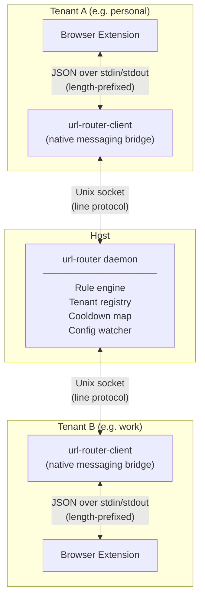
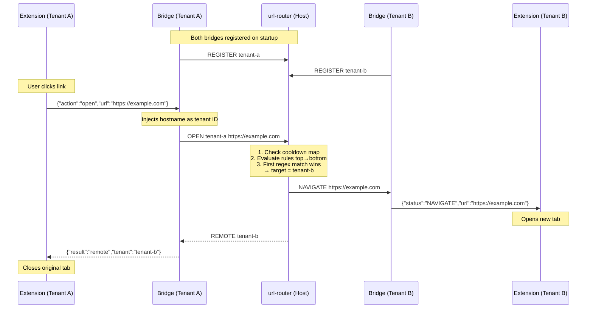

# URL Router

A multi-tenant URL routing system for Linux desktops. A daemon on the host
routes URLs between isolated browser instances running in different tenants
(host or systemd-nspawn containers), each identified by hostname.

When a user navigates to a URL that belongs to another tenant, the browser
extension intercepts the navigation, the daemon evaluates routing rules,
and the URL opens seamlessly in the correct tenant's browser — all within
a few milliseconds.

## How It Works

Three components collaborate to route URLs across tenant boundaries:



**Routing a URL from Tenant A to Tenant B:**



**Cooldown protection:** After routing a URL, the daemon suppresses the
same (tenant, URL) pair for a configurable window (default 2 seconds).
This prevents redirect loops when the target browser's extension sees the
newly opened URL and queries the daemon again.

## Installation

Two `.deb` packages are provided. Download them from the
[releases workflow](../../actions/workflows/deb.yml) artifacts.

### Host

```bash
sudo dpkg -i url-router_<version>_amd64.deb
sudo systemctl enable --now url-router
```

Installs the daemon (`/usr/bin/url-router`) and a systemd service that
starts it automatically.

### Each Tenant / Container

```bash
sudo dpkg -i url-router-client_<version>_amd64.deb
```

Installs:

- `/usr/bin/url-router-client` — native messaging bridge and CLI
- Native messaging manifests for Chromium (`/etc/chromium/native-messaging-hosts/`)
  and Edge (`/etc/opt/edge/native-messaging-hosts/`)
- The browser extension as a signed `.crx`, auto-installed via Chromium's
  [external extensions](https://developer.chrome.com/docs/extensions/how-to/distribute/install-extensions-linux)
  mechanism — no manual loading required
- A `.desktop` file so the client can be set as the default URL handler

**Expose the socket:** The daemon's Unix socket must be accessible from each
tenant. For systemd-nspawn containers, bind-mount it:

```bash
# In /etc/systemd/nspawn/<container>.nspawn:
[Files]
Bind=/run/url-router.sock
```

## Configuration

The daemon reads `~/.config/url-router/config.json` (or a path given as
the first CLI argument). It watches the file and hot-reloads changes
every two seconds. An example is provided in
[`config.example.json`](config.example.json).

```json
{
  "socket": "/run/url-router.sock",
  "tenants": {
    "host-machine": {
      "browser_cmd": "chromium",
      "label": "Host",
      "color": "#4285F4"
    },
    "work-container": {
      "browser_cmd": "machinectl shell work-container /usr/bin/chromium",
      "label": "Work",
      "color": "#EA4335"
    }
  },
  "rules": [
    { "pattern": "https://github\\.com/.*", "target": "work-container", "enabled": true },
    { "pattern": "https://mail\\.google\\.com/.*", "target": "host-machine", "enabled": true }
  ],
  "defaults": {
    "unmatched": "local",
    "cooldown_seconds": 2,
    "browser_launch_timeout": 10
  }
}
```

| Field | Description |
|-------|-------------|
| `socket` | Path to the Unix socket the daemon listens on. |
| `tenants` | Map of hostname → `{ browser_cmd, label, color }`. Keys must match the actual hostname of each tenant. |
| `rules` | Ordered list of regex patterns evaluated top-to-bottom. First match wins. |
| `defaults.unmatched` | `"local"` keeps unmatched URLs in the current tenant; set to a tenant hostname to route unmatched URLs there. |
| `defaults.cooldown_seconds` | Window (in seconds) during which repeated routing of the same (tenant, URL) pair is suppressed. |
| `defaults.browser_launch_timeout` | Seconds to wait for a tenant's browser to register after launching via `browser_cmd`. |

**Editing configuration:**

- **Extension settings page:** Open from the popup — provides a visual
  editor for rules, tenants, and defaults.
- **CLI:** `url-router-client get-config`, `set-config`, `add-rule`,
  `update-rule`, `delete-rule`.
- **Direct edit:** Modify the JSON file; the daemon picks up changes
  automatically.

## Usage

### CLI

When invoked with arguments, `url-router-client` acts as a CLI tool
(using `default` as the tenant ID):

```bash
url-router-client open <url>                  # Route URL through the rules engine
url-router-client open-on <tenant> <url>      # Send URL to a specific tenant
url-router-client test <url>                  # Dry-run: show which tenant matches
url-router-client status                      # Show registered tenants and uptime
url-router-client get-config                  # Print current configuration as JSON
url-router-client set-config <json-file>      # Replace the configuration
url-router-client add-rule '<json>'           # Append a routing rule
url-router-client update-rule <index> '<json>'# Update a rule by index
url-router-client delete-rule <index>         # Delete a rule by index
```

The socket path defaults to `/run/url-router.sock` and can be overridden
with the `URL_ROUTER_SOCKET` environment variable.

To use `url-router-client` as the default URL handler:

```bash
xdg-settings set default-web-browser url-router-client.desktop
```

### Browser Extension

**Navigation interception:** Every top-frame HTTP/HTTPS navigation is
checked against routing rules. If the URL belongs to another tenant, the
tab is closed and the URL opens in the correct browser.

**Toolbar badge:** Shows the target tenant's label and color for the
current page, indicating which tenant "owns" it.

**Popup:** Click the extension icon to see the current URL and
*Open in \<tenant\>* buttons. A *Remember* button creates a persistent
routing rule for the current site.

**Context menus:**

- Right-click a **page** → *Send to \<tenant\>* or *Assign to tenant…*
  (creates a routing rule)
- Right-click a **link** → *Open link in \<tenant\>*

## Building from Source

### Prerequisites

- OCaml ≥ 5.0 with [opam](https://opam.ocaml.org/)
- dune ≥ 3.0
- Node.js (for extension tests)

### Setup

```bash
opam install . --deps-only --with-test
cd extension && npm install && cd ..
```

### Make Targets

| Target | Description |
|--------|-------------|
| `make build` | Compile everything via `dune build @all` |
| `make test` | Run OCaml tests (`dune runtest`) |
| `make test-extension` | Run browser extension tests (Jest) |
| `make lint` | Type-check without linking (`dune build @check`) |
| `make fmt` | Auto-format with ocamlformat |
| `make deb VERSION=x.y.z` | Build `.deb` packages via `dpkg-buildpackage` |
| `make clean` | Remove build artifacts |

### Debian Packages

Packages are built using standard Debian tooling. The `debian/rules` file
calls `dune build --profile release` directly for optimized output
(the extension JS drops from ~7 MB to ~200 KB with dead-code elimination).

```bash
# Requires: fakeroot, debhelper
make deb VERSION=0.1.0
ls _build/deb/*.deb
```

## License

See [LICENSE](LICENSE) for details.
