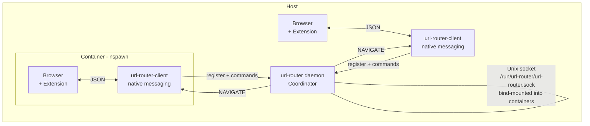
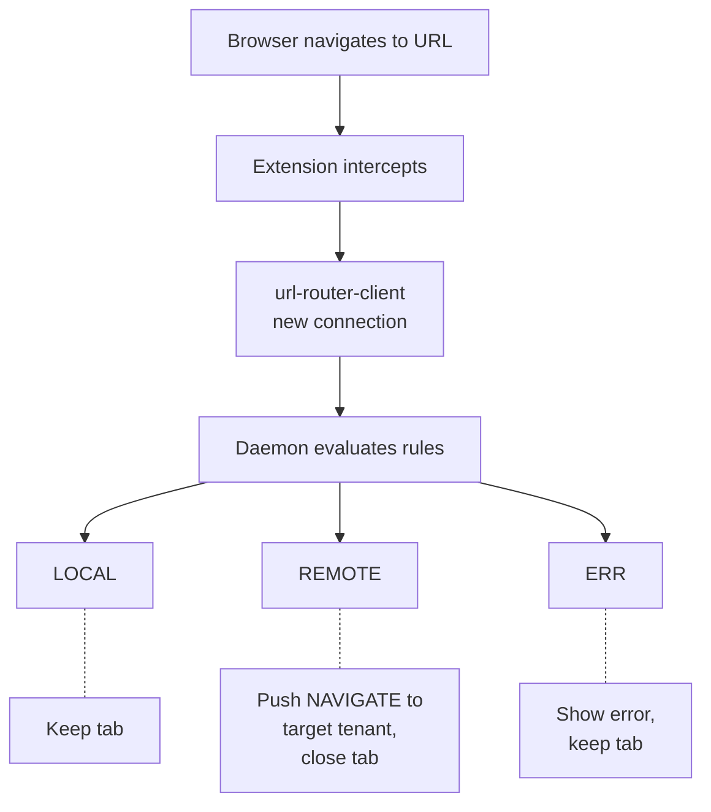
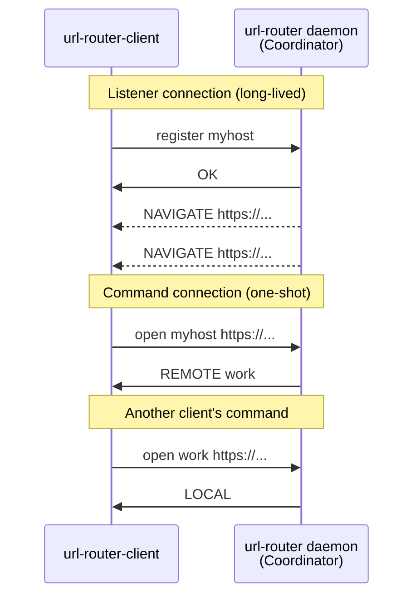
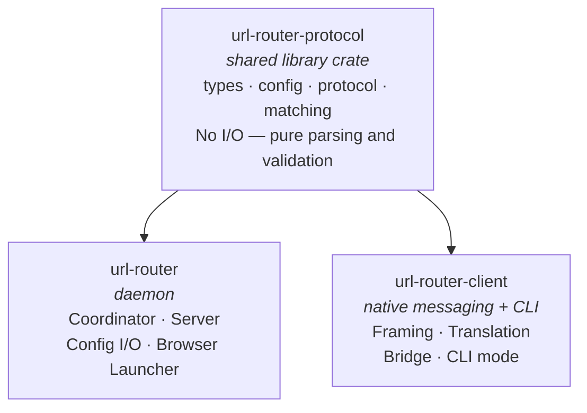
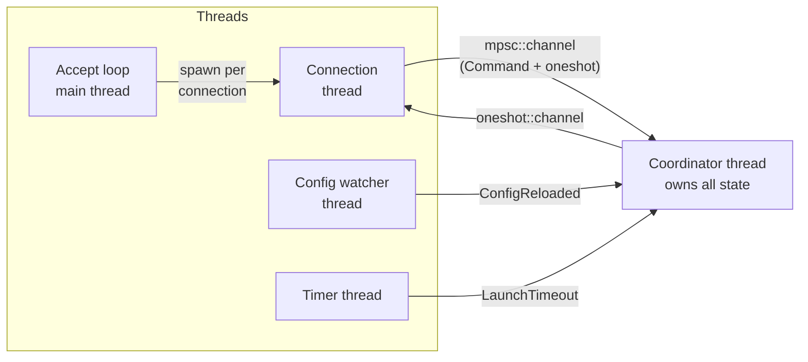

# URL Router

A multi-tenant URL routing system for Linux desktops. Routes URLs to the correct browser across a host and its [systemd-nspawn](https://www.freedesktop.org/software/systemd/man/systemd-nspawn.html) containers, so clicking a link always opens it in the right environment.

## How It Works

A single daemon runs on the host and listens on a shared Unix socket. Browser extensions in each tenant (host or container) connect to this socket through a native messaging bridge. When a URL is opened, the daemon evaluates routing rules and either keeps it in the current browser (`LOCAL`) or pushes it to the correct tenant's browser (`REMOTE`).



### Routing Flow



### Connection Model

Each `url-router-client` maintains two types of connections to the daemon:



- **Listener connection**: sends `register <hostname>`, then reads `NAVIGATE <url>` pushes
- **Command connections**: one per command, request-response, then closed

This eliminates bidirectional I/O on any single connection.

## Installation

### From Source

**Prerequisites:** Rust toolchain (1.70+), Node.js (18+), npm

```sh
# Build everything
make build

# Run tests
make test

# Install to system (as root)
sudo make install PREFIX=/usr

# Or build Debian packages
cargo install cargo-deb
make deb
# Packages in target/debian/
```

### Debian Packages

Two `.deb` packages are produced:

- **`url-router`** — the daemon binary, systemd service, desktop entry, and example config
- **`url-router-extension`** — the native messaging host binary (`url-router-client`), browser extension, and native messaging manifest

Install both on the host. Install only `url-router-extension` inside containers.

### Post-Install Setup

1. **Create the socket directory** (done automatically by tmpfiles.d on boot):

   ```sh
   sudo systemd-tmpfiles --create /usr/lib/tmpfiles.d/url-router.conf
   ```

2. **Start the daemon** (as your user):

   ```sh
   systemctl --user enable --now url-router
   ```

3. **Load the extension** in Chromium/Chrome/Edge:
   - Navigate to `chrome://extensions`
   - Enable "Developer mode"
   - Click "Load unpacked" → select `/usr/share/url-router/extension/`

4. **For containers**, bind-mount the socket and config. Add to your `.nspawn` file:

   ```ini
   [Files]
   Bind=/run/url-router
   BindReadOnly=/etc/url-router/config.json
   ```

   Install `url-router-extension` inside the container and load the extension there too.

5. **Set as default URL handler** (optional, for CLI/desktop entry routing):

   ```sh
   xdg-settings set default-web-browser url-router.desktop
   ```

## Configuration

The configuration file lives at `/etc/url-router/config.json`:

```json
{
  "socket": "/run/url-router/url-router.sock",
  "tenants": {
    "mydesktop": {
      "browser_cmd": "xdg-open",
      "badge_label": "P",
      "badge_color": "#4285f4"
    },
    "work-container": {
      "browser_cmd": "machinectl shell work-container -- chromium",
      "badge_label": "W",
      "badge_color": "#34a853"
    }
  },
  "rules": [
    {
      "pattern": ".*\\.corp\\.example\\.com",
      "tenant": "work-container"
    },
    {
      "pattern": "https://github\\.com/mycompany/.*",
      "tenant": "work-container"
    }
  ],
  "defaults": {
    "unmatched": "local",
    "notifications": true,
    "notification_timeout_ms": 3000,
    "cooldown_secs": 5,
    "browser_launch_timeout_secs": 15
  }
}
```

### Tenants

Each key in `tenants` **must match the hostname** of the machine or container it represents (the value of `/proc/sys/kernel/hostname`).

| Field | Description |
|---|---|
| `browser_cmd` | Command to launch the browser. For containers, include `machinectl shell`. Does **not** receive the URL as an argument — URLs are delivered via the extension. |
| `badge_label` | Short label shown on the extension badge (e.g., `"P"`, `"W"`) |
| `badge_color` | Badge background color (hex) |

### Rules

Rules are regex patterns evaluated top-to-bottom (first match wins) against the full URL. Each rule routes to a tenant by hostname key.

| Field | Description |
|---|---|
| `pattern` | Regex matched against the full URL |
| `tenant` | Tenant hostname key to route to |
| `enabled` | Optional, defaults to `true`. Set to `false` to skip the rule. |

### Defaults

| Field | Default | Description |
|---|---|---|
| `unmatched` | `"local"` | Where to send URLs that match no rule. `"local"` keeps them in the current tenant. Can be set to a tenant key. |
| `notifications` | `true` | Show desktop notifications on cross-tenant routing |
| `notification_timeout_ms` | `3000` | Notification display duration |
| `cooldown_secs` | `5` | Suppress duplicate routing for the same (tenant, URL) pair within this window |
| `browser_launch_timeout_secs` | `15` | How long to wait for a tenant's browser to register after launching `browser_cmd` |

### Config Reload

The daemon watches the config file for changes via inotify and reloads automatically. No restart needed.

## Usage

### Browser Extension

The extension works automatically once loaded. When you navigate to a URL that matches a routing rule:

- If the URL belongs to another tenant → the tab closes and the URL opens in the target tenant's browser
- If the URL belongs to the current tenant → nothing happens (tab stays)
- If the target tenant is unavailable → the tab stays and an error notification is shown

Right-click a link to see "Send to..." options for manual routing.

### Command Line

Use `url-router-client` to interact with the daemon from the terminal:

```sh
# Open a URL (evaluates routing rules, uses "default" as source tenant)
url-router-client open https://example.com

# Open a URL on a specific tenant
url-router-client open-on work-container https://example.com

# Test which tenant a URL routes to (dry run)
url-router-client test https://corp.example.com

# Get the current configuration
url-router-client get-config

# Get daemon status (registered tenants, etc.)
url-router-client status

# Use a non-default socket path
url-router-client --socket /tmp/test.sock open https://example.com
```

### Desktop Entry

The included `url-router.desktop` file allows setting url-router as the system's default URL handler. When another application opens a URL (e.g., clicking a link in a chat app), it goes through `url-router-client open`, which routes it to the correct tenant's browser.

## Architecture

### Components



### Daemon Internals

The daemon uses a **single-threaded coordinator** pattern — all mutable state (tenant registry, cooldown map, config, pending browser launches) is owned by one thread with no locks:



Communication uses `std::sync::mpsc` channels. Each command carries a oneshot response channel. No `Mutex`, `RwLock`, or `Condvar` anywhere — the architecture is inherently thread-safe by design.

### Browser Launch on Demand

If a URL routes to a tenant whose browser isn't running (no registered connection), the daemon:

1. Marks the tenant as "Launching" and queues the URL
2. Spawns `browser_cmd` as a background process
3. Starts a timeout timer
4. When the browser's extension registers → delivers all queued URLs via `NAVIGATE`
5. If the timeout expires → responds with `ERR` to all waiting callers

## Protocol Reference

The socket protocol is line-based (one message per line, newline-terminated).

### Commands (client → daemon)

| Command | Response |
|---|---|
| `register <tenant_id>` | `OK` · `ERR <message>` |
| `open <tenant_id> <url>` | `LOCAL` · `REMOTE <tenant_id>` · `ERR <message>` |
| `open-on <tenant_id> <url>` | `REMOTE <tenant_id>` · `ERR <message>` |
| `test <url>` | `MATCH <tenant_id> <rule_index>` · `NOMATCH <default_tenant>` |
| `get-config` | `CONFIG <json>` |
| `set-config <json>` | `OK` · `ERR <message>` |
| `add-rule <json>` | `OK` · `ERR <message>` |
| `update-rule <index> <json>` | `OK` · `ERR <message>` |
| `delete-rule <index>` | `OK` · `ERR <message>` |
| `status` | `STATUS <json>` |

### Server Push (daemon → registered client)

| Message | Description |
|---|---|
| `NAVIGATE <url>` | Open this URL in the tenant's browser |

### Special Tenant: `default`

The synthetic tenant ID `default` is used by CLI commands and the desktop entry handler. When `open default <url>` is sent, the daemon always pushes the URL to the resolved tenant — it never responds with `LOCAL`.

## License

MIT
