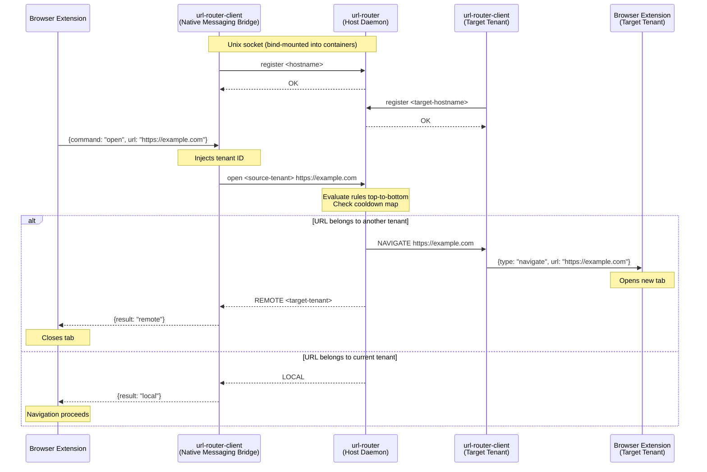
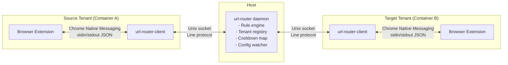

# URL Router

A multi-tenant URL routing system for Linux desktops using systemd-nspawn containers. A daemon on the host routes URLs between isolated browser instances running in different tenants (host or containers), identified by hostname.

**Components:**

- **url-router** — host daemon that evaluates routing rules and dispatches URLs
- **url-router-client** — native messaging bridge + CLI, runs in every tenant
- **Browser extension** — Chromium/Edge extension that intercepts navigations

## Installation

Two `.deb` packages are provided:

### Host

```bash
sudo dpkg -i url-router_<version>.deb
sudo systemctl enable --now url-router.service
```

This installs the daemon (`/usr/bin/url-router`) and its systemd unit.

### Each Tenant / Container

```bash
sudo dpkg -i url-router-client_<version>.deb
```

This installs:

- `/usr/bin/url-router-client` — bridge binary and CLI tool
- Native messaging host manifests for Chromium and Edge
- The browser extension as a signed `.crx`, auto-installed via the [external extensions mechanism](https://developer.chrome.com/docs/extensions/how-to/distribute/install-extensions-linux) — no manual loading required

The daemon's Unix socket must be bind-mounted into each container so tenants can connect.

## Configuration

The daemon reads `~/.config/url-router/config.json` (or the path specified at launch). It watches the file and reloads on changes.

```json
{
  "socket": "/run/url-router/url-router.sock",
  "tenants": {
    "host-machine": {
      "browser_cmd": "chromium",
      "label": "Host",
      "color": "#4285F4"
    },
    "work-container": {
      "browser_cmd": "machinectl shell work-container /usr/bin/chromium",
      "label": "Work",
      "color": "#EA4335"
    }
  },
  "rules": [
    { "pattern": "https://github\\.com/.*", "target": "work-container", "enabled": true },
    { "pattern": "https://mail\\.google\\.com/.*", "target": "host-machine", "enabled": true }
  ],
  "defaults": {
    "unmatched": "local",
    "cooldown_seconds": 5,
    "browser_launch_timeout": 30
  }
}
```

| Field | Description |
|-------|-------------|
| `tenants` | Map of hostname → `{ browser_cmd, label, color }`. Keys must match actual hostnames. |
| `rules` | Ordered list of regex rules evaluated top-to-bottom. First match wins. |
| `defaults.unmatched` | `"local"` keeps unmatched URLs in the current tenant, or a tenant hostname to route there. |
| `defaults.cooldown_seconds` | Suppresses redirect loops by ignoring repeated (tenant, URL) pairs within this window. |

**Editing configuration:**

- **CLI:** `url-router-client get-config` to view, or use the daemon protocol commands (`add-rule`, `update-rule`, `delete-rule`, `set-config`).
- **Extension:** Open the settings page from the popup. It provides a full editor for rules, tenants, and defaults. Changes are sent to the daemon via `set-config`.

## Usage

### CLI

The `url-router-client` binary doubles as a CLI when invoked with arguments (using `default` as the tenant ID):

```bash
# Route a URL through the rules engine — opens it in the matching tenant's browser
url-router-client open <url>

# Send a URL directly to a specific tenant
url-router-client open-on <tenant> <url>

# Dry-run: test which tenant a URL would route to
url-router-client test <url>

# Show daemon status (registered tenants, uptime)
url-router-client status

# Dump the current configuration as JSON
url-router-client get-config
```

To use `url-router-client` as the system default URL handler, register it with `xdg-settings`:

```bash
xdg-settings set default-web-browser url-router-client.desktop
```

### Browser Extension

**Navigation interception:** Every top-frame HTTP/HTTPS navigation is checked against the daemon's rules. If the URL belongs to another tenant, the tab is closed and the URL opens in the correct tenant's browser.

**Toolbar badge:** Shows the target tenant's label and color for the current page, indicating which tenant "owns" it.

**Popup:** Click the extension icon to see the current URL and "Open in \<tenant\>" buttons for each configured tenant. A "Remember" button creates a routing rule for the current site.

**Context menus:**

- Right-click a **page** → *Send to \<tenant\>* or *Assign tenant…* (creates a permanent rule)
- Right-click a **link** → *Open link in \<tenant\>*

## Building from Source

### Prerequisites

- OCaml ≥ 5.0
- [opam](https://opam.ocaml.org/) package manager
- dune ≥ 3.0
- js_of_ocaml ≥ 5.0 (for the browser extension)

### Setup

```bash
opam install . --deps-only --with-test
```

### Make Targets

| Target | Description |
|--------|-------------|
| `make build` | Compile everything (daemon, client, extension) via `dune build @all` |
| `make test` | Run unit tests via `dune runtest` |
| `make fmt` | Auto-format with ocamlformat |
| `make lint` | Type-check without linking (`dune build @check`) |
| `make clean` | Remove build artifacts |
| `make deb` | Build `url-router` and `url-router-client` `.deb` packages |

## Architecture





## License

See [LICENSE](LICENSE) for details.
